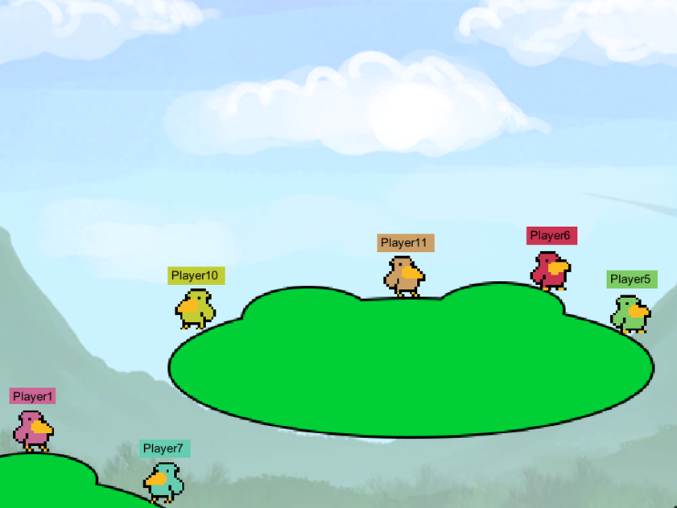

HFT-Unity Gamepad
=================

This is a sample Unity3D game for the [HappyFunTimes party games system](http://docs.happyfuntimes.net).

## Install

[Click here to get it from the unity asset store](http://assetstore.unity3d.com/en/#!/content/19668).

## What is it?

This one emulates a bunch of simple controllers. This allows you to get started with HappyFunTimes in
your Unity project very quickly.

Samples include a 2D platformer example inspired by [this tutorial from the unity website](https://unity3d.com/learn/tutorials/modules/beginner/2d)
unity website but with HappyFunTimes control added. There is also an example showing using orientation and
another example showing using the phone as a touch pad.

## Docs

[Some more docs can be found here](http://docs.happyfuntimes.net/docs/unity/gamepad.html).

## Changelist

[See here](http://docs.happyfuntimes.net/docs/unity/changelist.html)

